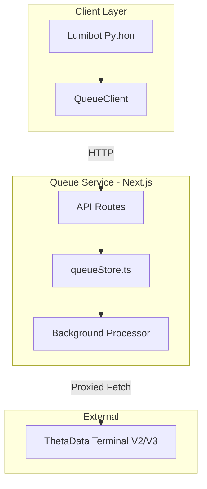
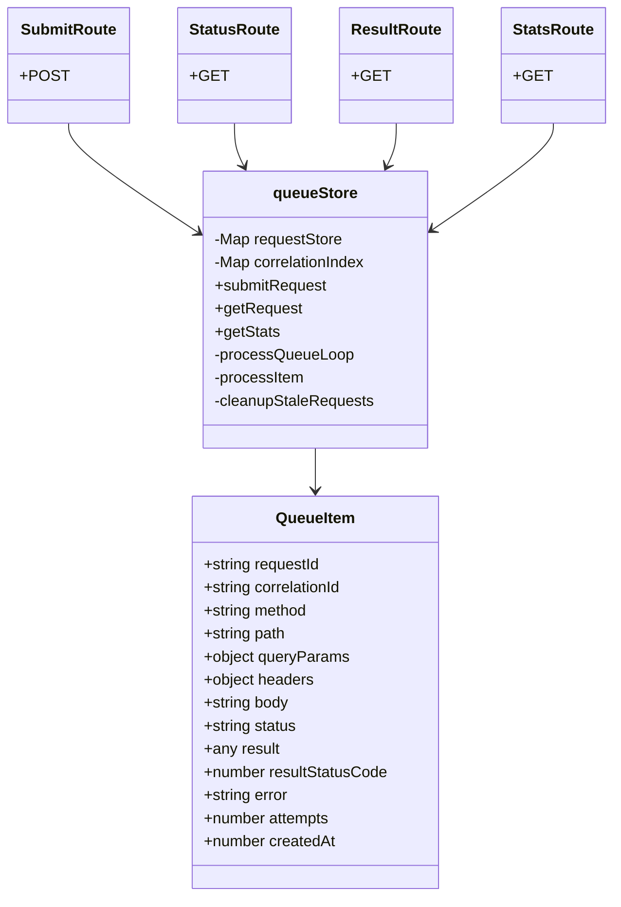

# ThetaData Queue Service - Architecture

## System Architecture Overview

## Source Code Paths

### Core Implementation

| Path | Purpose |
|------|---------|
| [`lib/queueStore.ts`](lib/queueStore.ts) | In-memory queue store, request processing logic |
| [`app/queue/submit/route.ts`](app/queue/submit/route.ts) | POST endpoint for submitting requests |
| [`app/queue/status/[requestId]/route.ts`](app/queue/status/[requestId]/route.ts) | GET endpoint for polling status |
| [`app/queue/[requestId]/result/route.ts`](app/queue/[requestId]/result/route.ts) | GET endpoint for retrieving results |
| [`app/queue/stats/route.ts`](app/queue/stats/route.ts) | GET endpoint for queue statistics |

### Reference Implementation - Lumibot

The `lumibot/` directory contains reference Python code showing client-side implementation:

| Path | Purpose |
|------|---------|
| `lumibot/lumibot/tools/thetadata_queue_client.py` | `QueueClient` class implementation |
| `lumibot/lumibot/tools/thetadata_helper.py` | Helper functions using QueueClient |
| `lumibot/lumibot/backtesting/thetadata_backtesting_pandas.py` | Backtesting engine using helpers |

## Key Technical Decisions

### 1. In-Memory Queue Storage

**Decision**: Use JavaScript `Map` objects for storing queue items.

**Rationale**:
- Simple implementation for local development use case
- No persistence requirements - queue resets on restart
- Fast O-1 lookup by requestId
- Secondary index by correlationId for idempotency

### 2. Single-Threaded Sequential Processing

**Decision**: Process one request at a time in a background loop.

**Rationale**:
- ThetaData Terminal has rate limits
- Sequential processing respects these limits naturally
- Simpler error handling and debugging

### 3. Cleanup on Result Fetch

**Decision**: Delete completed requests when their results are fetched.

**Rationale**:
- Keeps memory usage bounded
- Client is expected to fetch result only once
- 10-minute stale cleanup handles orphaned requests

### 4. Next.js App Router

**Decision**: Use Next.js 16 with App Router for API routes.

**Rationale**:
- Modern async/await patterns in route handlers
- Built-in request/response handling
- Easy path parameter extraction
- Hot reloading during development

## Component Relationships

## Critical Implementation Paths

### Request Submission Flow

1. Client POSTs to `/queue/submit` with payload
2. Route handler calls `submitRequest()`
3. Idempotency check via `correlationIndex`
4. New `QueueItem` created with `pending` status
5. `startBackgroundProcesses()` ensures processor is running
6. Response with `request_id`, `status`, `queue_position`

### Background Processing Flow

1. `processQueueLoop()` runs continuously
2. Finds oldest pending item via `requestStore.values()`
3. `processItem()` sets status to `processing`
4. Constructs URL from `THETADATA_BASE_URL` + path + queryParams
5. Executes fetch with method, headers, body
6. Parses response as JSON, fallback to text
7. Updates item with result, status `completed` or `failed`

### Result Retrieval Flow

1. Client GETs `/queue/{requestId}/result`
2. `getRequest()` fetches item from store
3. If `completed`: returns result with HTTP 200, deletes from store
4. If `pending`/`processing`: returns status with HTTP 202
5. If `failed`/`dead`: returns error with HTTP 500

## Design Patterns

- **Factory Pattern**: `submitRequest()` creates QueueItem objects with proper defaults
- **Repository Pattern**: `queueStore.ts` encapsulates all data access logic
- **Polling Pattern**: Client-side polling for async job completion
- **Idempotency Key Pattern**: `correlation_id` ensures duplicate submissions return existing request
