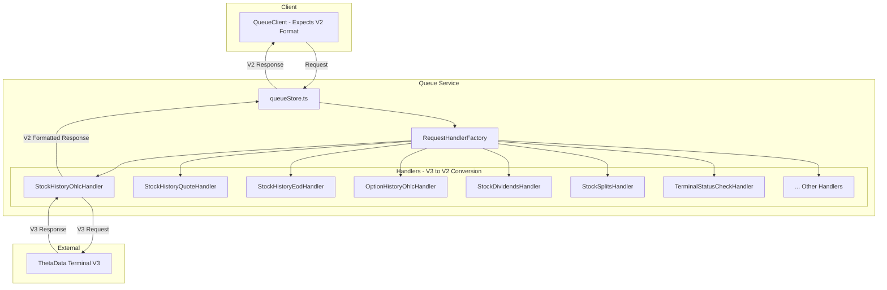
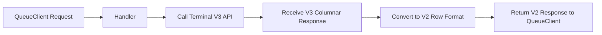
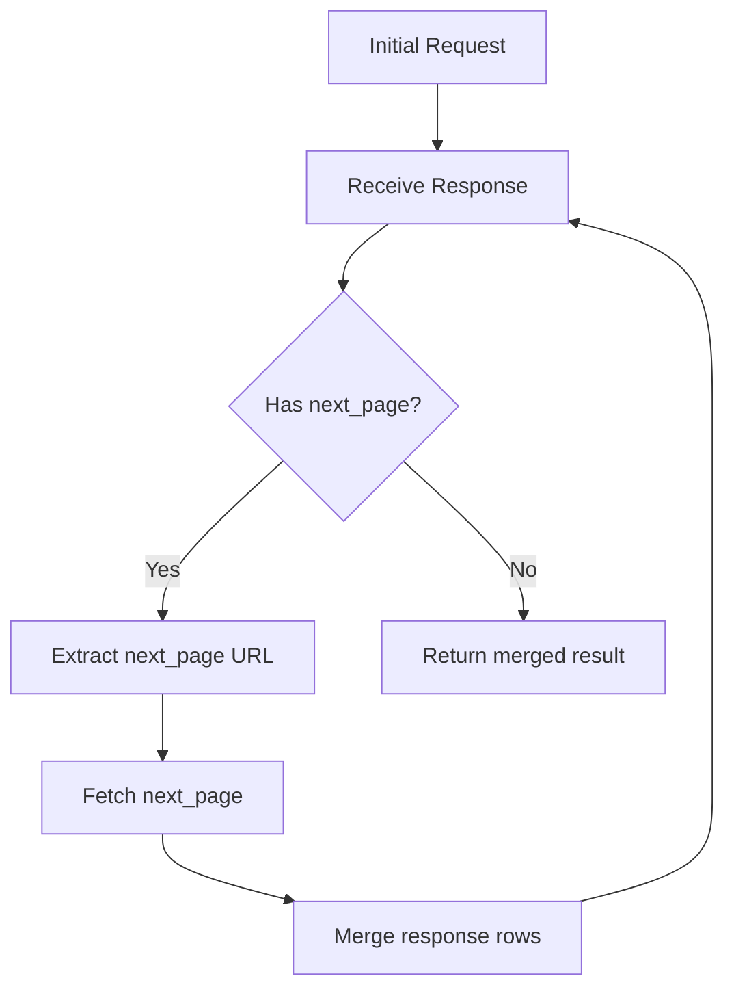

# Implementation Plan: Request Type Support

This document outlines the architecture and implementation strategy for handling all ThetaData request types in a modular, testable, and maintainable way.

## Key Constraint: V3 Terminal → V2 Response Format

**Important**: We are working with **ThetaData Terminal V3** (the locally running terminal), but the **QueueClient expects V2 response format**.

Rather than letting the QueueClient coerce the format, we will **convert V3 responses to V2 format ourselves** in the handlers. This gives us:
- Full control over data transformation
- Ability to handle edge cases explicitly
- Easier debugging and testing
- Consistent output regardless of terminal version

### Format Conversion Overview

| Source (Terminal V3) | Target (QueueClient V2) |
|---------------------|-------------------------|
| Columnar format: `{ col1: [...], col2: [...] }` | Row format: `{ header: { format: [...] }, response: [[...], [...]] }` |
| Native V3 response | V2-compatible response structure |

All handlers **MUST** ensure their output conforms to the V2 row-based format.

## Overview

The current [`lib/queueStore.ts`](../lib/queueStore.ts) handles all requests generically. This plan introduces a **Request Handler** pattern that:

1. Provides type-safe handling for each request type
2. Separates concerns (routing, transformation, HTTP status management)
3. Enables isolated unit testing
4. **Converts V3 Terminal responses to V2 format** expected by QueueClient

## Architecture



### Data Flow: V3 Terminal → V2 QueueClient



## Directory Structure

```
lib/
├── queueStore.ts                    # Main queue logic - uses handlers
├── handlers/
│   ├── index.ts                     # Exports all handlers + factory
│   ├── types.ts                     # Shared TypeScript interfaces
│   ├── base/
│   │   ├── BaseRequestHandler.ts    # Abstract base class
│   │   ├── V3RequestHandler.ts      # V3-specific base class
│   │   └── V2RequestHandler.ts      # V2-specific base class
│   ├── stock/
│   │   ├── StockHistoryOhlcHandler.ts
│   │   ├── StockHistoryQuoteHandler.ts
│   │   ├── StockHistoryEodHandler.ts
│   │   ├── StockDividendsHandler.ts      # V2
│   │   └── StockSplitsHandler.ts         # V2
│   ├── option/
│   │   ├── OptionHistoryOhlcHandler.ts
│   │   ├── OptionHistoryQuoteHandler.ts
│   │   ├── OptionHistoryEodHandler.ts
│   │   ├── OptionListExpirationsHandler.ts
│   │   ├── OptionListStrikesHandler.ts
│   │   └── OptionListDatesQuoteHandler.ts
│   ├── index/
│   │   ├── IndexHistoryOhlcHandler.ts
│   │   ├── IndexHistoryPriceHandler.ts
│   │   └── IndexHistoryEodHandler.ts
│   └── terminal/
│       ├── TerminalStatusCheckHandler.ts
│       ├── TerminalShutdownHandler.ts
│       └── OptionExpirationsHealthCheckHandler.ts
├── factory/
│   └── RequestHandlerFactory.ts     # Creates handler based on path
scripts/
├── fetch-sample-data/
│   ├── README.md
│   ├── fetch-stock-ohlc.ts          # Script to capture raw request/response
│   ├── fetch-stock-dividends.ts
│   └── ... (one per request type)
test/
├── fixtures/
│   ├── stock-history-ohlc/
│   │   ├── request.json
│   │   └── response.json
│   ├── stock-dividends/
│   │   ├── request.json
│   │   └── response.json
│   └── ... (one folder per request type)
├── handlers/
│   ├── stock/
│   │   ├── StockHistoryOhlcHandler.test.ts
│   │   ├── StockDividendsHandler.test.ts
│   │   └── ...
│   ├── option/
│   └── ...
└── integration/
    └── queueStore.test.ts           # Integration tests
```

---

## Phase 1: Data Capture Scripts

### Purpose
Create TypeScript scripts that call ThetaData Terminal directly and store raw request/response pairs as fixtures for testing and reference.

### Script Template: `scripts/fetch-sample-data/fetch-{request-type}.ts`

```typescript
/**
 * Fetch Sample Data Script: Stock History OHLC
 * 
 * Calls ThetaData Terminal directly and stores raw request/response.
 * 
 * Usage: npx ts-node scripts/fetch-sample-data/fetch-stock-ohlc.ts
 */

import fs from 'fs';
import path from 'path';

const THETADATA_BASE_URL = process.env.THETADATA_BASE_URL || 'http://127.0.0.1:25503';

interface CapturedData {
  timestamp: string;
  request: {
    url: string;
    method: string;
    headers: Record<string, string>;
    queryParams: Record<string, string>;
  };
  response: {
    status: number;
    headers: Record<string, string>;
    body: unknown;
    rawText: string;
  };
}

async function fetchAndCapture(): Promise<void> {
  const endpoint = '/v3/stock/history/ohlc';
  const queryParams = {
    root: 'AAPL',
    start: '20240101',
    end: '20240105',
    ivl: '5m'
  };

  const url = new URL(endpoint, THETADATA_BASE_URL);
  Object.entries(queryParams).forEach(([k, v]) => url.searchParams.set(k, v));

  console.log(`Fetching: ${url.toString()}`);

  const response = await fetch(url.toString(), {
    method: 'GET',
    headers: { 'Accept': 'application/json' }
  });

  const rawText = await response.text();
  let body: unknown;
  try {
    body = JSON.parse(rawText);
  } catch {
    body = rawText;
  }

  const captured: CapturedData = {
    timestamp: new Date().toISOString(),
    request: {
      url: url.toString(),
      method: 'GET',
      headers: { 'Accept': 'application/json' },
      queryParams
    },
    response: {
      status: response.status,
      headers: Object.fromEntries(response.headers.entries()),
      body,
      rawText
    }
  };

  // Save to fixtures
  const fixtureDir = path.join(__dirname, '../../test/fixtures/stock-history-ohlc');
  fs.mkdirSync(fixtureDir, { recursive: true });
  
  fs.writeFileSync(
    path.join(fixtureDir, 'captured-data.json'),
    JSON.stringify(captured, null, 2)
  );

  console.log(`Saved to: ${fixtureDir}/captured-data.json`);
  console.log(`Response status: ${response.status}`);
}

fetchAndCapture().catch(console.error);
```

### Scripts Needed

| Request Type | Script Name | API Version |
|--------------|-------------|-------------|
| Terminal Status Check | `fetch-terminal-status.ts` | V3 |
| Option Expirations Health | `fetch-option-expirations-health.ts` | V3 |
| Stock History OHLC | `fetch-stock-ohlc.ts` | V3 |
| Stock History Quote | `fetch-stock-quote.ts` | V3 |
| Stock History EOD | `fetch-stock-eod.ts` | V3 |
| Option History OHLC | `fetch-option-ohlc.ts` | V3 |
| Option History Quote | `fetch-option-quote.ts` | V3 |
| Option History EOD | `fetch-option-eod.ts` | V3 |
| Index History OHLC | `fetch-index-ohlc.ts` | V3 |
| Index History Price | `fetch-index-price.ts` | V3 |
| Index History EOD | `fetch-index-eod.ts` | V3 |
| Option List Expirations | `fetch-option-expirations.ts` | V3 |
| Option List Strikes | `fetch-option-strikes.ts` | V3 |
| Option List Dates Quote | `fetch-option-dates-quote.ts` | V3 |
| Stock Dividends | `fetch-stock-dividends.ts` | **V2** |
| Stock Splits | `fetch-stock-splits.ts` | **V2** |
| Terminal Shutdown | `fetch-terminal-shutdown.ts` | V3 |

---

## Phase 2: Base Handler Classes

### `lib/handlers/types.ts`

```typescript
/**
 * Handler request/response types
 */

export interface HandlerRequest {
  method: string;
  path: string;
  queryParams: Record<string, unknown>;
  headers: Record<string, string>;
  body: string | null;
}

export interface HandlerResponse {
  statusCode: number;
  body: unknown;
  headers?: Record<string, string>;
  error?: string;
}

export interface RequestHandler {
  /** Unique identifier for this handler */
  readonly handlerId: string;
  
  /** Path patterns this handler responds to */
  readonly pathPatterns: RegExp[];
  
  /** API version: v2 or v3 */
  readonly apiVersion: 'v2' | 'v3';
  
  /** Check if this handler can process the given path */
  canHandle(path: string): boolean;
  
  /** Pre-process request before sending to ThetaData */
  prepareRequest(request: HandlerRequest): Promise<PreparedRequest>;
  
  /** Execute the request against ThetaData Terminal */
  execute(request: HandlerRequest): Promise<HandlerResponse>;
  
  /** Post-process response from ThetaData */
  processResponse(rawResponse: unknown, statusCode: number): HandlerResponse;
}

export interface PreparedRequest {
  url: string;
  method: string;
  headers: Record<string, string>;
  body?: string | Buffer;
}
```

### `lib/handlers/base/BaseRequestHandler.ts`

```typescript
import type { 
  HandlerRequest, 
  HandlerResponse, 
  PreparedRequest, 
  RequestHandler 
} from '../types';

export abstract class BaseRequestHandler implements RequestHandler {
  abstract readonly handlerId: string;
  abstract readonly pathPatterns: RegExp[];
  abstract readonly apiVersion: 'v2' | 'v3';
  
  protected readonly baseUrl: string;
  
  constructor(baseUrl: string) {
    this.baseUrl = baseUrl;
  }
  
  canHandle(path: string): boolean {
    return this.pathPatterns.some(pattern => pattern.test(path));
  }
  
  abstract prepareRequest(request: HandlerRequest): Promise<PreparedRequest>;
  
  async execute(request: HandlerRequest): Promise<HandlerResponse> {
    try {
      const prepared = await this.prepareRequest(request);
      
      const response = await fetch(prepared.url, {
        method: prepared.method,
        headers: prepared.headers,
        body: prepared.body
      });
      
      const rawText = await response.text();
      let rawBody: unknown;
      
      try {
        rawBody = JSON.parse(rawText);
      } catch {
        rawBody = rawText;
      }
      
      return this.processResponse(rawBody, response.status);
      
    } catch (error) {
      return {
        statusCode: 500,
        body: null,
        error: error instanceof Error ? error.message : String(error)
      };
    }
  }
  
  abstract processResponse(rawResponse: unknown, statusCode: number): HandlerResponse;
  
  /** Helper: Map ThetaData status codes to standard HTTP responses */
  protected mapStatusCode(thetaStatus: number): number {
    // ThetaData-specific status codes
    switch (thetaStatus) {
      case 472: return 204; // No data -> No Content
      case 571: return 503; // Server starting -> Service Unavailable
      default: return thetaStatus;
    }
  }
  
  /** Helper: Convert columnar response to row format */
  protected columnarToRows(columnar: Record<string, unknown[]>): {
    header: { format: string[] };
    response: unknown[][];
  } {
    const columns = Object.keys(columnar);
    if (columns.length === 0) {
      return { header: { format: [] }, response: [] };
    }
    
    const rowCount = (columnar[columns[0]] as unknown[]).length;
    const rows: unknown[][] = [];
    
    for (let i = 0; i < rowCount; i++) {
      rows.push(columns.map(col => (columnar[col] as unknown[])[i]));
    }
    
    return {
      header: { format: columns },
      response: rows
    };
  }
}
```

### `lib/handlers/base/V3RequestHandler.ts`

```typescript
import { BaseRequestHandler } from './BaseRequestHandler';
import type { HandlerRequest, PreparedRequest } from '../types';

export abstract class V3RequestHandler extends BaseRequestHandler {
  readonly apiVersion = 'v3' as const;
  
  /** V3 endpoint path (without /v3 prefix) */
  abstract readonly endpoint: string;
  
  async prepareRequest(request: HandlerRequest): Promise<PreparedRequest> {
    // Build URL with V3 prefix
    const cleanPath = this.endpoint.replace(/^\/+/, '');
    const url = new URL(`/v3/${cleanPath}`, this.baseUrl);
    
    // Add query params
    if (request.queryParams) {
      Object.entries(request.queryParams).forEach(([k, v]) => {
        if (Array.isArray(v)) {
          v.forEach(subV => url.searchParams.append(k, String(subV)));
        } else if (v !== undefined && v !== null) {
          url.searchParams.set(k, String(v));
        }
      });
    }
    
    return {
      url: url.toString(),
      method: request.method,
      headers: {
        'Accept': 'application/json',
        ...request.headers
      }
    };
  }
}
```

### `lib/handlers/base/V2RequestHandler.ts`

```typescript
import { BaseRequestHandler } from './BaseRequestHandler';
import type { HandlerRequest, PreparedRequest } from '../types';

export abstract class V2RequestHandler extends BaseRequestHandler {
  readonly apiVersion = 'v2' as const;
  
  /** V2 endpoint path (without /v2 prefix) */
  abstract readonly endpoint: string;
  
  /** V2 endpoints often need different param names */
  abstract mapQueryParams(params: Record<string, unknown>): Record<string, string>;
  
  async prepareRequest(request: HandlerRequest): Promise<PreparedRequest> {
    // Build URL with V2 prefix
    const cleanPath = this.endpoint.replace(/^\/+/, '');
    const url = new URL(`/v2/${cleanPath}`, this.baseUrl);
    
    // Map and add query params (V2 uses different naming conventions)
    const mappedParams = this.mapQueryParams(request.queryParams);
    
    Object.entries(mappedParams).forEach(([k, v]) => {
      url.searchParams.set(k, v);
    });
    
    // V2 always needs these params
    url.searchParams.set('use_csv', 'false');
    url.searchParams.set('pretty_time', 'false');
    
    return {
      url: url.toString(),
      method: request.method,
      headers: {
        'Accept': 'application/json',
        ...request.headers
      }
    };
  }
}
```

---

## Phase 3: Concrete Handler Implementations

### Example V3 Handler: `lib/handlers/stock/StockHistoryOhlcHandler.ts`

```typescript
import { V3RequestHandler } from '../base/V3RequestHandler';
import type { HandlerResponse } from '../types';

export class StockHistoryOhlcHandler extends V3RequestHandler {
  readonly handlerId = 'stock-history-ohlc';
  readonly endpoint = 'stock/history/ohlc';
  readonly pathPatterns = [
    /^\/v3\/stock\/history\/ohlc$/i,
    /^stock\/history\/ohlc$/i
  ];
  
  processResponse(rawResponse: unknown, statusCode: number): HandlerResponse {
    // Handle no-data response
    if (statusCode === 472) {
      return {
        statusCode: 204,
        body: { header: { format: [] }, response: [] }
      };
    }
    
    // Handle columnar format (V3 default)
    if (this.isColumnarFormat(rawResponse)) {
      const converted = this.columnarToRows(rawResponse as Record<string, unknown[]>);
      return {
        statusCode: this.mapStatusCode(statusCode),
        body: converted
      };
    }
    
    // Already in row format
    return {
      statusCode: this.mapStatusCode(statusCode),
      body: rawResponse
    };
  }
  
  private isColumnarFormat(data: unknown): boolean {
    if (typeof data !== 'object' || data === null) return false;
    const obj = data as Record<string, unknown>;
    // Row format has 'header' and 'response' keys
    // Columnar format has column names as keys with array values
    return !('header' in obj) && !('response' in obj) &&
           Object.values(obj).every(v => Array.isArray(v));
  }
}
```

### Example V2 Handler: `lib/handlers/stock/StockDividendsHandler.ts`

```typescript
import { V2RequestHandler } from '../base/V2RequestHandler';
import type { HandlerResponse } from '../types';

export class StockDividendsHandler extends V2RequestHandler {
  readonly handlerId = 'stock-dividends';
  readonly endpoint = 'hist/stock/dividend';
  readonly pathPatterns = [
    /^\/v2\/hist\/stock\/dividend$/i,
    /^hist\/stock\/dividend$/i
  ];
  
  /**
   * Map V3-style params to V2 param names
   * V3 uses: root, start, end
   * V2 uses: root, start_date, end_date
   */
  mapQueryParams(params: Record<string, unknown>): Record<string, string> {
    const mapped: Record<string, string> = {};
    
    if (params.root) mapped.root = String(params.root);
    
    // V3 sends 'start', V2 expects 'start_date'
    if (params.start) mapped.start_date = String(params.start);
    if (params.start_date) mapped.start_date = String(params.start_date);
    
    // V3 sends 'end', V2 expects 'end_date'
    if (params.end) mapped.end_date = String(params.end);
    if (params.end_date) mapped.end_date = String(params.end_date);
    
    return mapped;
  }
  
  processResponse(rawResponse: unknown, statusCode: number): HandlerResponse {
    if (statusCode === 472) {
      return {
        statusCode: 204,
        body: { header: { format: [] }, response: [] }
      };
    }
    
    // V2 responses are already in row format
    return {
      statusCode: this.mapStatusCode(statusCode),
      body: rawResponse
    };
  }
}
```

---

## Phase 4: Handler Factory

### `lib/factory/RequestHandlerFactory.ts`

```typescript
import type { RequestHandler, HandlerRequest } from '../handlers/types';

// Import all handlers
import { StockHistoryOhlcHandler } from '../handlers/stock/StockHistoryOhlcHandler';
import { StockHistoryQuoteHandler } from '../handlers/stock/StockHistoryQuoteHandler';
import { StockHistoryEodHandler } from '../handlers/stock/StockHistoryEodHandler';
import { StockDividendsHandler } from '../handlers/stock/StockDividendsHandler';
import { StockSplitsHandler } from '../handlers/stock/StockSplitsHandler';
import { OptionHistoryOhlcHandler } from '../handlers/option/OptionHistoryOhlcHandler';
import { OptionHistoryQuoteHandler } from '../handlers/option/OptionHistoryQuoteHandler';
import { OptionHistoryEodHandler } from '../handlers/option/OptionHistoryEodHandler';
import { OptionListExpirationsHandler } from '../handlers/option/OptionListExpirationsHandler';
import { OptionListStrikesHandler } from '../handlers/option/OptionListStrikesHandler';
import { OptionListDatesQuoteHandler } from '../handlers/option/OptionListDatesQuoteHandler';
import { IndexHistoryOhlcHandler } from '../handlers/index/IndexHistoryOhlcHandler';
import { IndexHistoryPriceHandler } from '../handlers/index/IndexHistoryPriceHandler';
import { IndexHistoryEodHandler } from '../handlers/index/IndexHistoryEodHandler';
import { TerminalStatusCheckHandler } from '../handlers/terminal/TerminalStatusCheckHandler';
import { TerminalShutdownHandler } from '../handlers/terminal/TerminalShutdownHandler';
import { OptionExpirationsHealthCheckHandler } from '../handlers/terminal/OptionExpirationsHealthCheckHandler';

export class RequestHandlerFactory {
  private handlers: RequestHandler[] = [];
  
  constructor(baseUrl: string) {
    // Register all handlers
    this.handlers = [
      // Terminal
      new TerminalStatusCheckHandler(baseUrl),
      new TerminalShutdownHandler(baseUrl),
      new OptionExpirationsHealthCheckHandler(baseUrl),
      
      // Stock V3
      new StockHistoryOhlcHandler(baseUrl),
      new StockHistoryQuoteHandler(baseUrl),
      new StockHistoryEodHandler(baseUrl),
      
      // Stock V2
      new StockDividendsHandler(baseUrl),
      new StockSplitsHandler(baseUrl),
      
      // Option V3
      new OptionHistoryOhlcHandler(baseUrl),
      new OptionHistoryQuoteHandler(baseUrl),
      new OptionHistoryEodHandler(baseUrl),
      new OptionListExpirationsHandler(baseUrl),
      new OptionListStrikesHandler(baseUrl),
      new OptionListDatesQuoteHandler(baseUrl),
      
      // Index V3
      new IndexHistoryOhlcHandler(baseUrl),
      new IndexHistoryPriceHandler(baseUrl),
      new IndexHistoryEodHandler(baseUrl),
    ];
  }
  
  /**
   * Find the appropriate handler for a given path
   */
  getHandler(path: string): RequestHandler | null {
    return this.handlers.find(h => h.canHandle(path)) || null;
  }
  
  /**
   * Get all registered handler IDs
   */
  getRegisteredHandlers(): string[] {
    return this.handlers.map(h => h.handlerId);
  }
}
```

---

## Phase 5: Integration with queueStore.ts

### Modified `lib/queueStore.ts`

The key change is in the `processItem` function:

```typescript
import { RequestHandlerFactory } from './factory/RequestHandlerFactory';

// Initialize factory once
const handlerFactory = new RequestHandlerFactory(THETADATA_BASE_URL);

async function processItem(item: QueueItem) {
  item.status = 'processing';
  item.attempts += 1;
  requestStore.set(item.requestId, item);

  try {
    // Try to find a specialized handler
    const handler = handlerFactory.getHandler(item.path);
    
    if (handler) {
      // Use type-specific handler
      console.log(`Using handler: ${handler.handlerId} for path: ${item.path}`);
      
      const result = await handler.execute({
        method: item.method,
        path: item.path,
        queryParams: item.queryParams,
        headers: item.headers,
        body: item.body
      });
      
      item.result = result.body;
      item.resultStatusCode = result.statusCode;
      item.status = result.error ? 'failed' : 'completed';
      item.error = result.error || null;
      
    } else {
      // Fallback to generic passthrough (existing logic)
      console.log(`No handler found for path: ${item.path}, using passthrough`);
      await processItemGeneric(item);
    }
    
  } catch (e: any) {
    console.error(`Request ${item.requestId} failed:`, e);
    item.error = String(e);
    item.status = 'failed';
    item.resultStatusCode = 500;
  }
}

// Keep existing logic as fallback
async function processItemGeneric(item: QueueItem) {
  // ... existing processItem logic ...
}
```

---

## Phase 6: Unit Testing Strategy

### Test Structure

Each handler should have comprehensive unit tests that:

1. **Test request preparation** - Verify URL construction and param mapping
2. **Test response processing** - Verify transformation and status code mapping
3. **Test error handling** - Verify graceful failure modes
4. **Use fixture data** - Load captured real responses for realistic testing

### Example Test: `test/handlers/stock/StockHistoryOhlcHandler.test.ts`

```typescript
import { describe, it, expect, beforeEach } from 'bun:test';
import { StockHistoryOhlcHandler } from '../../../lib/handlers/stock/StockHistoryOhlcHandler';
import fixtureData from '../../fixtures/stock-history-ohlc/captured-data.json';

describe('StockHistoryOhlcHandler', () => {
  let handler: StockHistoryOhlcHandler;
  
  beforeEach(() => {
    handler = new StockHistoryOhlcHandler('http://localhost:25503');
  });
  
  describe('canHandle', () => {
    it('should match V3 stock OHLC path', () => {
      expect(handler.canHandle('/v3/stock/history/ohlc')).toBe(true);
    });
    
    it('should match path without version prefix', () => {
      expect(handler.canHandle('stock/history/ohlc')).toBe(true);
    });
    
    it('should not match other paths', () => {
      expect(handler.canHandle('/v3/option/history/ohlc')).toBe(false);
    });
  });
  
  describe('prepareRequest', () => {
    it('should build correct URL with query params', async () => {
      const prepared = await handler.prepareRequest({
        method: 'GET',
        path: '/v3/stock/history/ohlc',
        queryParams: { root: 'AAPL', start: '20240101', end: '20240105', ivl: '5m' },
        headers: {},
        body: null
      });
      
      expect(prepared.url).toContain('/v3/stock/history/ohlc');
      expect(prepared.url).toContain('root=AAPL');
      expect(prepared.url).toContain('start=20240101');
      expect(prepared.url).toContain('ivl=5m');
    });
  });
  
  describe('processResponse', () => {
    it('should handle columnar format', () => {
      const columnarData = {
        date: [20240101, 20240101],
        ms_of_day: [37800000, 37900000],
        open: [182.50, 183.00],
        high: [183.25, 183.50],
        low: [182.00, 182.75],
        close: [183.00, 183.25],
        volume: [12500000, 12800000],
        count: [150, 200]
      };
      
      const result = handler.processResponse(columnarData, 200);
      
      expect(result.statusCode).toBe(200);
      expect(result.body).toHaveProperty('header');
      expect(result.body).toHaveProperty('response');
      expect((result.body as any).response).toHaveLength(2);
    });
    
    it('should handle 472 no-data response', () => {
      const result = handler.processResponse({}, 472);
      
      expect(result.statusCode).toBe(204);
      expect((result.body as any).response).toEqual([]);
    });
    
    it('should process real fixture data', () => {
      const result = handler.processResponse(
        fixtureData.response.body,
        fixtureData.response.status
      );
      
      expect(result.statusCode).toBeLessThan(500);
      expect(result.body).toBeDefined();
    });
  });
});
```

### V2 Handler Test: `test/handlers/stock/StockDividendsHandler.test.ts`

```typescript
import { describe, it, expect, beforeEach } from 'bun:test';
import { StockDividendsHandler } from '../../../lib/handlers/stock/StockDividendsHandler';

describe('StockDividendsHandler', () => {
  let handler: StockDividendsHandler;
  
  beforeEach(() => {
    handler = new StockDividendsHandler('http://localhost:25503');
  });
  
  describe('mapQueryParams', () => {
    it('should map V3-style params to V2 format', () => {
      const mapped = handler.mapQueryParams({
        root: 'AAPL',
        start: '20240101',
        end: '20241231'
      });
      
      expect(mapped).toEqual({
        root: 'AAPL',
        start_date: '20240101',
        end_date: '20241231'
      });
    });
    
    it('should handle V2-style params passthrough', () => {
      const mapped = handler.mapQueryParams({
        root: 'AAPL',
        start_date: '20240101',
        end_date: '20241231'
      });
      
      expect(mapped.start_date).toBe('20240101');
    });
  });
  
  describe('prepareRequest', () => {
    it('should add V2 required params', async () => {
      const prepared = await handler.prepareRequest({
        method: 'GET',
        path: 'hist/stock/dividend',
        queryParams: { root: 'AAPL', start: '20240101', end: '20241231' },
        headers: {},
        body: null
      });
      
      expect(prepared.url).toContain('/v2/hist/stock/dividend');
      expect(prepared.url).toContain('use_csv=false');
      expect(prepared.url).toContain('pretty_time=false');
    });
  });
});
```

---

## Request Type Coverage Matrix

| Request Type | Handler Class | API | Path Pattern | Priority |
|--------------|---------------|-----|--------------|----------|
| Terminal Status Check | `TerminalStatusCheckHandler` | V3 | `/v3/terminal/mdds/status` | P0 |
| Option Expirations Health | `OptionExpirationsHealthCheckHandler` | V3 | `/v3/option/list/expirations` | P0 |
| Stock History OHLC | `StockHistoryOhlcHandler` | V3 | `/v3/stock/history/ohlc` | P0 |
| Stock History Quote | `StockHistoryQuoteHandler` | V3 | `/v3/stock/history/quote` | P1 |
| Stock History EOD | `StockHistoryEodHandler` | V3 | `/v3/stock/history/eod` | P0 |
| Option History OHLC | `OptionHistoryOhlcHandler` | V3 | `/v3/option/history/ohlc` | P1 |
| Option History Quote | `OptionHistoryQuoteHandler` | V3 | `/v3/option/history/quote` | P1 |
| Option History EOD | `OptionHistoryEodHandler` | V3 | `/v3/option/history/eod` | P1 |
| Index History OHLC | `IndexHistoryOhlcHandler` | V3 | `/v3/index/history/ohlc` | P2 |
| Index History Price | `IndexHistoryPriceHandler` | V3 | `/v3/index/history/price` | P2 |
| Index History EOD | `IndexHistoryEodHandler` | V3 | `/v3/index/history/eod` | P2 |
| Option List Expirations | `OptionListExpirationsHandler` | V3 | `/v3/option/list/expirations` | P1 |
| Option List Strikes | `OptionListStrikesHandler` | V3 | `/v3/option/list/strikes` | P1 |
| Option List Dates Quote | `OptionListDatesQuoteHandler` | V3 | `/v3/option/list/dates/quote` | P2 |
| Stock Dividends | `StockDividendsHandler` | **V2** | `/v2/hist/stock/dividend` | P1 |
| Stock Splits | `StockSplitsHandler` | **V2** | `/v2/hist/stock/split` | P1 |
| Terminal Shutdown | `TerminalShutdownHandler` | V3 | `/v3/terminal/shutdown` | P2 |

---

## V3 Terminal → V2 Response Conversion (Critical)

### The Conversion Contract

**All handlers MUST convert ThetaData Terminal V3 responses to V2 format before returning to QueueClient.**

This is the core responsibility of every handler - ensure the QueueClient receives data in the format it expects.

### Terminal V3 Endpoints We Call

All requests go to the local ThetaData Terminal V3. The terminal exposes endpoints like:
- `/v3/stock/history/ohlc` - Stock OHLC data
- `/v3/option/history/ohlc` - Option OHLC data
- `/v3/terminal/mdds/status` - Terminal status
- `/v2/hist/stock/dividend` - Dividends (legacy V2 endpoint still on Terminal)
- `/v2/hist/stock/split` - Splits (legacy V2 endpoint still on Terminal)

### Response Format Conversion

**Terminal V3 returns columnar format:**
```json
{
  "date": [20240101, 20240102],
  "ms_of_day": [37800000, 37860000],
  "open": [182.50, 183.00],
  "high": [183.25, 183.50],
  "low": [182.00, 182.75],
  "close": [183.00, 183.25],
  "volume": [12500000, 12800000],
  "count": [150, 200]
}
```

**QueueClient expects V2 row format:**
```json
{
  "header": {
    "format": ["date", "ms_of_day", "open", "high", "low", "close", "volume", "count"]
  },
  "response": [
    [20240101, 37800000, 182.50, 183.25, 182.00, 183.00, 12500000, 150],
    [20240102, 37860000, 183.00, 183.50, 182.75, 183.25, 12800000, 200]
  ]
}
```

### Conversion Algorithm

```typescript
function columnarToV2Format(columnar: Record<string, unknown[]>): V2Response {
  const columns = Object.keys(columnar);
  if (columns.length === 0) {
    return { header: { format: [] }, response: [] };
  }
  
  const rowCount = (columnar[columns[0]] as unknown[]).length;
  const rows: unknown[][] = [];
  
  for (let i = 0; i < rowCount; i++) {
    rows.push(columns.map(col => columnar[col][i]));
  }
  
  return {
    header: { format: columns },
    response: rows
  };
}
```

### Handler Responsibility Matrix

| Handler | Terminal Endpoint | Conversion Required |
|---------|-------------------|---------------------|
| StockHistoryOhlcHandler | `/v3/stock/history/ohlc` | V3 columnar → V2 row |
| StockHistoryQuoteHandler | `/v3/stock/history/quote` | V3 columnar → V2 row |
| StockHistoryEodHandler | `/v3/stock/history/eod` | V3 columnar → V2 row |
| OptionHistoryOhlcHandler | `/v3/option/history/ohlc` | V3 columnar → V2 row |
| OptionHistoryQuoteHandler | `/v3/option/history/quote` | V3 columnar → V2 row |
| OptionHistoryEodHandler | `/v3/option/history/eod` | V3 columnar → V2 row |
| IndexHistoryOhlcHandler | `/v3/index/history/ohlc` | V3 columnar → V2 row |
| IndexHistoryPriceHandler | `/v3/index/history/price` | V3 columnar → V2 row |
| IndexHistoryEodHandler | `/v3/index/history/eod` | V3 columnar → V2 row |
| OptionListExpirationsHandler | `/v3/option/list/expirations` | V3 → V2 row |
| OptionListStrikesHandler | `/v3/option/list/strikes` | V3 → V2 row |
| OptionListDatesQuoteHandler | `/v3/option/list/dates/quote` | V3 → V2 row |
| StockDividendsHandler | `/v2/hist/stock/dividend` | Already V2 - passthrough |
| StockSplitsHandler | `/v2/hist/stock/split` | Already V2 - passthrough |
| TerminalStatusCheckHandler | `/v3/terminal/mdds/status` | Status object - minimal transform |
| TerminalShutdownHandler | `/v3/terminal/shutdown` | Status object - minimal transform |

### Edge Cases

1. **Empty responses**: Return `{ header: { format: [] }, response: [] }`
2. **Single row**: Same conversion, just one row in `response` array
3. **Status code 472 (no data)**: Convert to HTTP 204 with empty V2 response
4. **Mixed types in columns**: Preserve original types during conversion

### V2 Endpoint Parameter Mapping

For legacy V2 endpoints (dividends, splits), we also need to map parameters:

| V3 Param Name | V2 Param Name |
|---------------|---------------|
| `start` | `start_date` |
| `end` | `end_date` |
| `root` | `root` (unchanged) |
| - | `use_csv=false` (always add) |
| - | `pretty_time=false` (always add) |

---

## Pagination Handling

### Overview

ThetaData returns large result sets across multiple pages. Each response includes a `next_page` URL in the header if more data is available. The handlers must automatically follow all pagination links and merge results into a single response.

### Response Structure with Pagination

```json
{
  "header": {
    "format": ["date", "ms_of_day", "open", "high", "low", "close", "volume"],
    "next_page": "http://127.0.0.1:25503/v3/stock/history/ohlc?root=AAPL&start=20240102&end=20240105&ivl=1m&offset=10000",
    "error_type": "null"
  },
  "response": [
    [20240101, 37800000, 182.50, 183.25, 182.00, 183.00, 12500000],
    ...
  ]
}
```

### Pagination Flow



### Handler Pagination Interface

Add pagination support to the base handler:

```typescript
// lib/handlers/types.ts
export interface PaginatedResponse {
  header: {
    format: string[];
    next_page?: string | null;
    error_type?: string;
  };
  response: unknown[][];
}

export interface RequestHandler {
  // ... existing methods ...
  
  /**
   * Execute request with automatic pagination handling
   * Follows next_page URLs and merges all results
   */
  executeWithPagination(request: HandlerRequest): Promise<HandlerResponse>;
}
```

### Base Handler Pagination Implementation

```typescript
// lib/handlers/base/BaseRequestHandler.ts

export abstract class BaseRequestHandler implements RequestHandler {
  // ... existing code ...
  
  protected readonly maxPages: number = 100; // Safety limit
  protected readonly paginationDelayMs: number = 50; // Rate limit protection
  
  async executeWithPagination(request: HandlerRequest): Promise<HandlerResponse> {
    const allRows: unknown[][] = [];
    let headerFormat: string[] = [];
    let pageCount = 0;
    let nextPageUrl: string | null = null;
    
    try {
      // First request uses original URL with query params
      let currentRequest = request;
      
      while (pageCount < this.maxPages) {
        pageCount++;
        
        const prepared = await this.prepareRequest(currentRequest);
        const requestUrl = nextPageUrl || prepared.url;
        
        console.log(`[PAGINATION] Page ${pageCount}: ${requestUrl}`);
        
        const response = await fetch(requestUrl, {
          method: prepared.method,
          headers: prepared.headers,
          body: prepared.body
        });
        
        const rawText = await response.text();
        let rawBody: unknown;
        
        try {
          rawBody = JSON.parse(rawText);
        } catch {
          rawBody = rawText;
        }
        
        // Check for pagination in response
        if (this.isPaginatedResponse(rawBody)) {
          const paginated = rawBody as PaginatedResponse;
          
          // Store header format from first page
          if (pageCount === 1 && paginated.header?.format) {
            headerFormat = paginated.header.format;
          }
          
          // Merge rows
          if (Array.isArray(paginated.response)) {
            allRows.push(...paginated.response);
          }
          
          // Check for next page
          const nextPage = paginated.header?.next_page;
          if (nextPage && nextPage !== 'null' && nextPage !== '') {
            nextPageUrl = nextPage;
            
            // Small delay between pages for rate limiting
            await this.sleep(this.paginationDelayMs);
          } else {
            // No more pages
            break;
          }
        } else {
          // Non-paginated response, process normally and exit
          return this.processResponse(rawBody, response.status);
        }
      }
      
      // Build merged response in V2 format
      const mergedResponse = {
        header: { format: headerFormat },
        response: allRows
      };
      
      console.log(`[PAGINATION] Complete: ${pageCount} page(s), ${allRows.length} total rows`);
      
      return {
        statusCode: 200,
        body: mergedResponse
      };
      
    } catch (error) {
      return {
        statusCode: 500,
        body: null,
        error: error instanceof Error ? error.message : String(error)
      };
    }
  }
  
  private isPaginatedResponse(data: unknown): boolean {
    if (typeof data !== 'object' || data === null) return false;
    const obj = data as Record<string, unknown>;
    return 'header' in obj && 'response' in obj;
  }
  
  private sleep(ms: number): Promise<void> {
    return new Promise(resolve => setTimeout(resolve, ms));
  }
}
```

### Handler-Specific Pagination Control

Some handlers may need custom pagination behavior:

```typescript
// lib/handlers/stock/StockHistoryOhlcHandler.ts

export class StockHistoryOhlcHandler extends V3RequestHandler {
  // Override pagination settings for large data requests
  protected readonly maxPages = 200;
  protected readonly paginationDelayMs = 100;
  
  // ... rest of implementation
}

// lib/handlers/terminal/TerminalStatusCheckHandler.ts

export class TerminalStatusCheckHandler extends V3RequestHandler {
  // Status checks never paginate - use execute() directly
  async execute(request: HandlerRequest): Promise<HandlerResponse> {
    // Direct execution without pagination
    return super.execute(request);
  }
  
  // ... rest of implementation
}
```

### queueStore Integration

The `processItem` function should use `executeWithPagination` for data requests:

```typescript
async function processItem(item: QueueItem) {
  // ... existing setup code ...
  
  const handler = handlerFactory.getHandler(item.path);
  
  if (handler) {
    // Check if this request type supports pagination
    const isPaginatable = handler.handlerId.includes('history') ||
                          handler.handlerId.includes('list');
    
    const result = isPaginatable
      ? await handler.executeWithPagination(request)
      : await handler.execute(request);
    
    // ... rest of processing
  }
}
```

### Pagination Testing

Test pagination with fixtures that include `next_page`:

```typescript
// test/handlers/stock/StockHistoryOhlcHandler.pagination.test.ts

describe('StockHistoryOhlcHandler Pagination', () => {
  it('should follow next_page links and merge results', async () => {
    // Mock fetch to return paginated responses
    const page1 = {
      header: {
        format: ['date', 'close'],
        next_page: 'http://localhost:25503/v3/stock/history/ohlc?offset=100'
      },
      response: [[20240101, 182.50], [20240102, 183.00]]
    };
    
    const page2 = {
      header: { format: ['date', 'close'], next_page: null },
      response: [[20240103, 184.00], [20240104, 185.00]]
    };
    
    // ... mock fetch to return page1 then page2 ...
    
    const result = await handler.executeWithPagination(request);
    
    expect(result.statusCode).toBe(200);
    expect((result.body as any).response).toHaveLength(4);
  });
  
  it('should respect maxPages limit', async () => {
    // Test that we don't infinitely loop
  });
  
  it('should handle empty next_page correctly', async () => {
    // next_page: "" or next_page: "null" should stop pagination
  });
});
```

### Pagination Considerations

| Aspect | Strategy |
|--------|----------|
| **Safety Limit** | Max 100-200 pages per request to prevent infinite loops |
| **Rate Limiting** | 50-100ms delay between page fetches |
| **Error Recovery** | If a page fails, return what we have so far with partial status |
| **Memory** | Stream results to avoid holding all pages in memory for very large datasets |
| **Logging** | Log page count and total rows for debugging |
| **Testing** | Mock paginated responses in unit tests |

---

## Implementation Order

### Phase 1: Foundation
1. Create directory structure
2. Implement `types.ts`
3. Implement `BaseRequestHandler.ts`
4. Implement `V3RequestHandler.ts`
5. Implement `V2RequestHandler.ts`

### Phase 2: Core Handlers
1. `TerminalStatusCheckHandler` (P0 - needed for health checks)
2. `StockHistoryOhlcHandler` (P0 - most common request)
3. `StockHistoryEodHandler` (P0 - EOD backtesting)

### Phase 3: Factory Integration
1. Implement `RequestHandlerFactory.ts`
2. Modify `queueStore.ts` to use factory
3. Add fallback for unhandled paths

### Phase 4: Remaining Handlers
1. Stock handlers (Quote)
2. Option handlers (OHLC, Quote, EOD, List)
3. Index handlers
4. V2 handlers (Dividends, Splits)

### Phase 5: Testing & Validation
1. Create fixture capture scripts
2. Write unit tests for each handler
3. Integration tests with queueStore
4. Manual testing with ThetaData Terminal

---

## Benefits of This Architecture

1. **Isolation**: Each handler is a self-contained unit that can be modified without affecting others
2. **Testability**: Handlers can be unit tested with fixture data, no live API needed
3. **Extensibility**: New request types are added by creating a new handler class
4. **Type Safety**: TypeScript interfaces ensure consistent request/response shapes
5. **Maintainability**: Clear separation between V2 and V3 API handling
6. **Debugging**: Each handler has its own ID for logging and tracing
7. **Fallback**: Generic passthrough handles unknown request types gracefully
